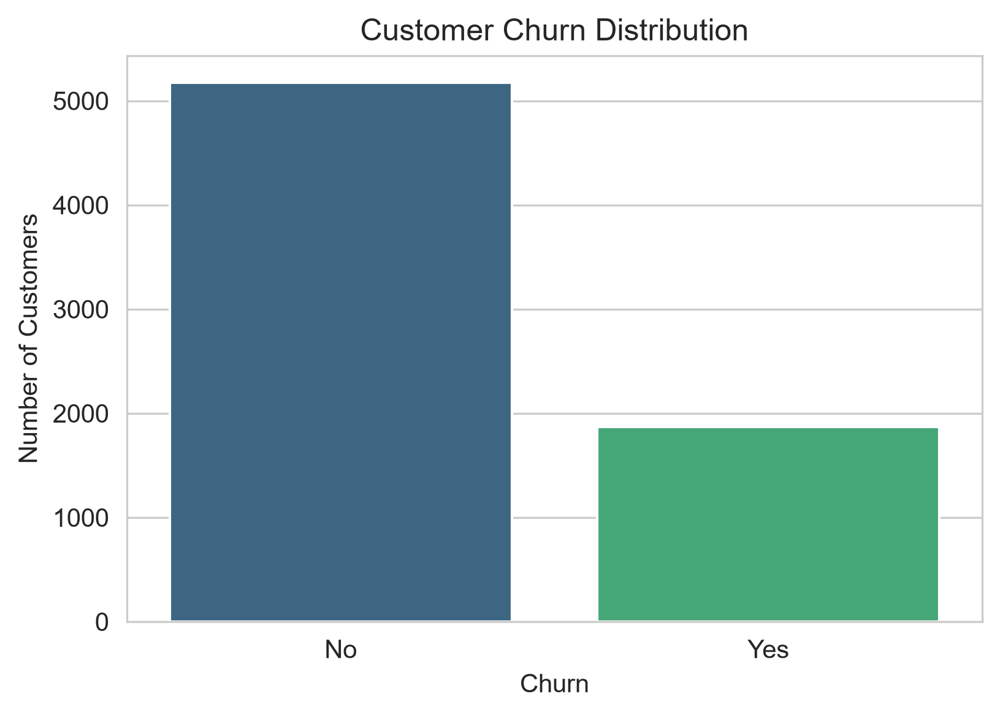
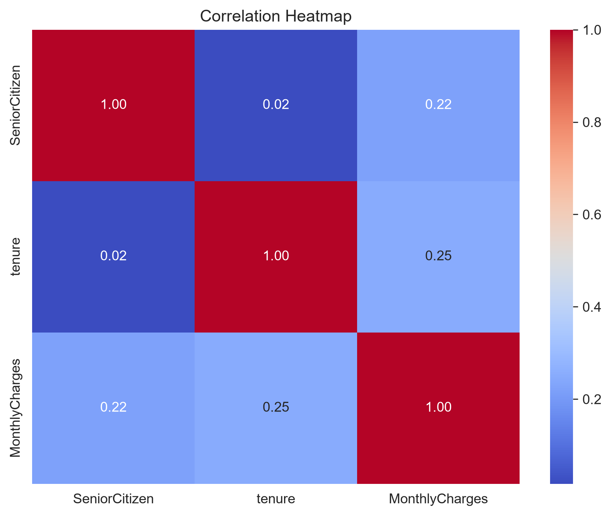
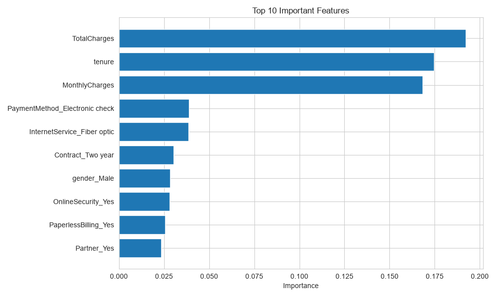
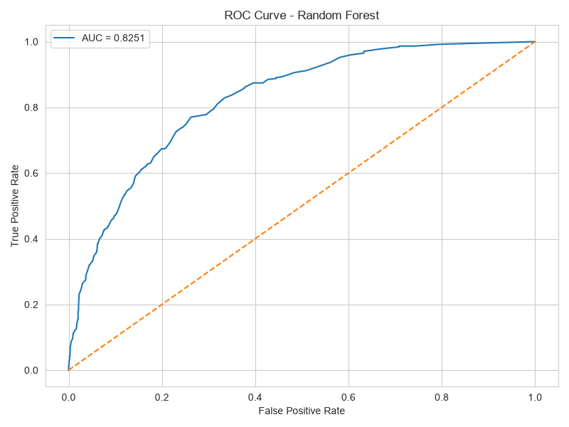

# 📊 Customer Churn Analysis

Predicting customer churn using Machine Learning and uncovering business insights through SQL and Exploratory Data Analysis.

---

## 📌 Project Overview

Customer churn is one of the biggest challenges for subscription-based businesses. This project analyzes customer behavior, identifies factors contributing to churn, and builds predictive machine learning models to estimate the likelihood of customer attrition.

The project combines:

- 📊 Exploratory Data Analysis (EDA)
- 🧹 Data Cleaning & Feature Engineering
- 🤖 Machine Learning (Logistic Regression & Random Forest)
- 🗄️ SQL Business Analysis
- 📈 Data Visualization

---

## 🛠 Tech Stack

| Category | Technologies |
|----------|--------------|
| Language | Python, SQL |
| Libraries | Pandas, NumPy, Matplotlib, Seaborn, Scikit-learn |
| Database | MySQL |
| Notebook | Jupyter |
| IDE | VS Code |

---

# 📂 Project Structure

```
Customer-Churn-Analysis/
│
├── data/
│     └── Telco-Customer-Churn.csv
│
├── notebook/
│     └── Customer_Churn_Analysis.ipynb
│
├── sql/
│     └── churn_analysis.sql
│
├── images/
│     ├── churn_distribution.png
│     ├── correlation_heatmap.png
│     ├── feature_importance.png
│     ├── roc_curve.png
│     └── ...
│
├── requirements.txt
├── README.md
└── LICENSE
```

---

# 📈 Exploratory Data Analysis

The following visualizations were created during EDA:

- Customer Churn Distribution
- Contract Type vs Churn
- Monthly Charges Distribution
- Correlation Heatmap
- Gender vs Churn
- Internet Service vs Churn
- Payment Method vs Churn
- Tenure vs Churn


## 📷 Sample Visualizations

### Churn Distribution



---

### Correlation Heatmap



---

### Feature Importance



---

### ROC Curve


---

# 🤖 Machine Learning Models

### Logistic Regression

- Accuracy
- Precision
- Recall
- F1 Score
- Confusion Matrix

### Random Forest Classifier

- Accuracy
- Precision
- Recall
- F1 Score
- Feature Importance
- ROC Curve
- AUC Score

---

# 🗄 SQL Business Analysis

The project includes **20 business-oriented SQL queries**, such as:

- Overall Churn Rate
- Churn by Contract Type
- Churn by Payment Method
- Churn by Internet Service
- Revenue by Contract
- Senior Citizen Analysis
- Average Monthly Charges
- Customer Segmentation
- Highest Paying Customers
- Tenure Analysis

---

# 📊 Business Insights

Key findings from the analysis include:

- Month-to-month contract customers exhibit the highest churn.
- Customers using Fiber Optic internet services have a higher churn rate.
- Customers with higher monthly charges are more likely to churn.
- Lack of Tech Support and Online Security is associated with increased churn.
- Long-tenure customers are significantly more likely to remain with the company.

---

# 🚀 Future Improvements

- XGBoost & LightGBM Models
- Hyperparameter Tuning
- Model Deployment using Flask
- Streamlit Dashboard
- Power BI Dashboard Integration

---

# 👨‍💻 Author

**Utsav Sachan**

GitHub:
https://github.com/Cyanide07x

LinkedIn:
https://www.linkedin.com/in/utsav-sachan-7759b4250/

Email:
Utsav0724@gmail.com

---